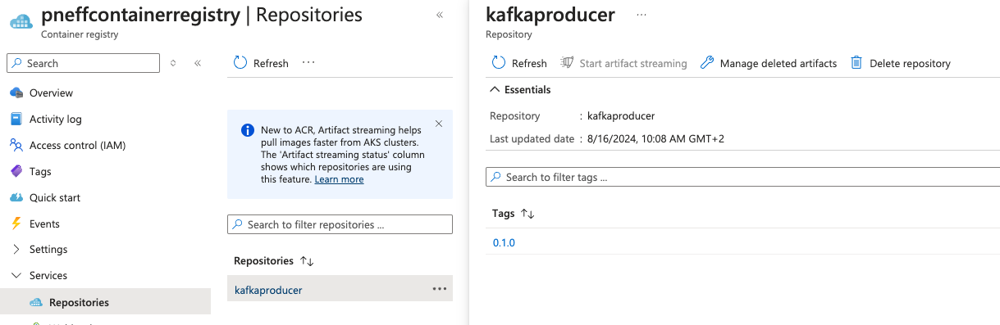
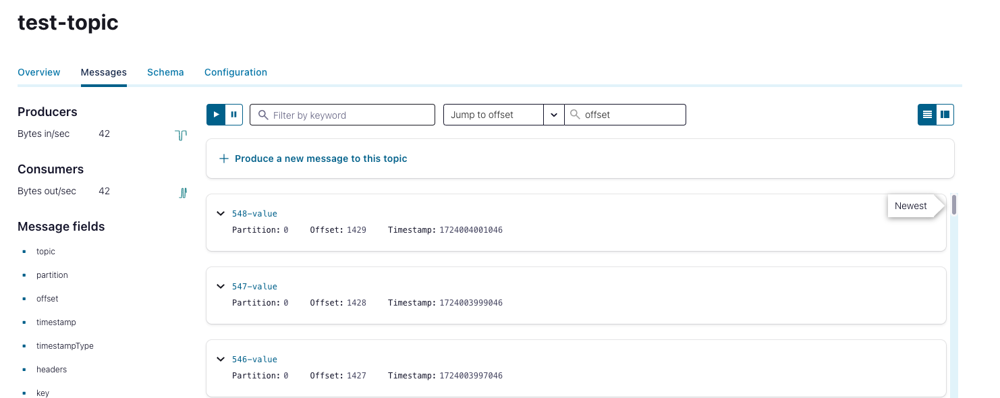

# OAuth for CFK with Azure

[Confluent Platform 7.7](https://docs.confluent.io/platform/current/release-notes/index.html) and [CFK 2.9.0](https://docs.confluent.io/operator/current/release-notes.html) released OAuth support.
This repository sets up a basic CP cluster via CFK running on Azure Kubernetes Service (AKS) enforcing
external clients to use OAuth for authentication with Azure AD (Entra ID) as the identity provider.

In technical detail it deploys:
* 1 KraftController
* 3 Kafka brokers
* 1 Producer application (client)
* 1 Control Center

General resources:
* [Quickstart: Deploy an Azure Kubernetes Service (AKS) cluster using Azure portal](https://learn.microsoft.com/en-us/azure/aks/learn/quick-kubernetes-deploy-portal?tabs=azure-cli)
* [Confluent for Kubernetes Quick Start](https://docs.confluent.io/operator/current/co-quickstart.html)
* [CP OAuth documentation](https://docs.confluent.io/platform/current/security/authentication/sasl/oauthbearer/overview.html#sasl-oauthbearer-authentication-overview)

> [!NOTE]
> This repositry only focusses on Confluent Platform, not Confluent Cloud.
> For an example for OAuth with Confluent Cloud check out [https://github.com/pneff93/ccloud-clients-oauth](https://github.com/pneff93/ccloud-clients-oauth).


## Azure AD endpoints

For the later configuration we need to set the `token_endpoint`, the `jwks_uri`, and the `issuer`.
We can obtain all information via

```shell
curl https://login.microsoftonline.com/<tenant-id>/v2.0/.well-known/openid-configuration | jq
```

Generally, those are
```
token_endpoint = https://login.microsoftonline.com/<tenant-id>/oauth2/v2.0/token
jwks_uri = https://login.microsoftonline.com/<tenant-id>/discovery/v2.0/keys
issuer = https://login.microsoftonline.com/<tenant-id>/v2.0
```

## Azure AD applications

To retrieve the JWT token, CP is using the client credentials grant flow. So, we need to register an application in Azure AD
and create a secret. 
We can get a JWT token via: 
```
curl -X POST -H "Content-Type: application/x-www-form-urlencoded" \
-d 'client_id=[client_id]&client_secret=[client_secret value]&grant_type=client_credentials' \
https://login.microsoftonline.com/[tenant_id]/oauth2/token
```

> [!NOTE]
> In this example, we only register one application in Azure AD. Consider different applications with its secret per CP component
> and client


## CFK cluster

* [CFK server-side OAuth/OIDC authentication](https://docs.confluent.io/operator/current/co-authenticate-kafka.html#server-side-oauth-oidc-authentication-for-ak-and-kraft)

Store the clientId and secret in a file and deploy it as a k8s secret. 
```shell
kubectl create -n confluent secret generic oauth-jass --from-file=oauth.txt=client-credentials.txt
```

Afterwards, we configure the Kafka CR
```yaml
listeners:
  external:
    authentication:
      type: oauth
      jaasConfig:
        secretRef: oauth-jass
      oauthSettings:
        groupsClaimName: groups
        subClaimName: sub
        audience: <client-id>
        expectedIssuer: see above
        jwksEndpointUri: see above
        tokenEndpointUri: see above
configOverrides:
  server:
    - listener.name.external.oauthbearer.sasl.server.callback.handler.class=org.apache.kafka.common.security.oauthbearer.secured.OAuthBearerValidatorCallbackHandler
    - listener.name.external.oauthbearer.sasl.jaas.config=org.apache.kafka.common.security.oauthbearer.OAuthBearerLoginModule required;
```

Once the `confluent-operator` is running, we deploy the cluster with 

```
kubectl apply -f ./cluster.yaml -n confluent
```


## Producer Application

We develop a simple producer application producing events in a for loop.
We set the configuration to:

```kotlin
settings.setProperty(CommonClientConfigs.SECURITY_PROTOCOL_CONFIG, "SASL_PLAINTEXT")
settings.setProperty(SaslConfigs.SASL_MECHANISM, "OAUTHBEARER")
settings.setProperty(SaslConfigs.SASL_LOGIN_CONNECT_TIMEOUT_MS, "15000")
settings.setProperty(SaslConfigs.SASL_OAUTHBEARER_TOKEN_ENDPOINT_URL, "https://login.microsoftonline.com/<tenant-id>/oauth2/v2.0/token")
settings.setProperty(SaslConfigs.SASL_LOGIN_CALLBACK_HANDLER_CLASS, "org.apache.kafka.common.security.oauthbearer.secured.OAuthBearerLoginCallbackHandler")
settings.setProperty(SaslConfigs.SASL_JAAS_CONFIG, "org.apache.kafka.common.security.oauthbearer.OAuthBearerLoginModule required clientId='<client-id>' clientSecret='<client-secret' scope='<Azure client id of the broker application>/.default';")
```
Note, that we need to add the scope to the `sasl.jaas.config` which is `<Azure client id of the broker application>/.default`.


### Azure Container Registry

* [Quickstart: Create an Azure container registry using the Azure portal](https://learn.microsoft.com/en-us/azure/container-registry/container-registry-get-started-portal?tabs=azure-cli)

To use the Producer application in the AKS cluster, we need to build and push an image to the Azure Container Registry (ACR) and integrate
it with the AKS cluster.


```
# Login to Container Registry
az login
az acr login --name <acr-name>

# Attach Container Registry to AKS cluster
az aks update --name <aks-name> --resource-group <rg-group> --attach-acr <aks-name>

# Check if the attachment was successful
az aks check-acr --resource-group <rg-group> --name <aks-name> --acr <aks-name>.azurecr.io
```

### Deploy Producer application

We build the image via
```
# Build fatJar 
./gradlew fatJar

# Build image (fatJar needs to be located in main folder)
docker build -t kafkaproducer .

# And tag to the built image
docker tag kafkaproducer <aks-name>.azurecr.io/kafkaproducer:0.1.0

# Push the image to the registry via 
docker push <aks-name>.azurecr.io/kafkaproducer:0.1.0
```




Deploy the Kafka Producer via
```
kubectl apply -f ./KafkaProducer/Deployment.yaml -n confluent
```

If everything runs successfully we should obtain similar logs

```
16:44:18.015 [Thread-0] INFO  org.apache.kafka.common.security.oauthbearer.internals.expiring.ExpiringCredentialRefreshingLogin - Successfully logged in.
16:44:18.042 [kafka-expiring-relogin-thread-4113761a-d187-402f-a48a-8ae0e86f78dd] INFO  org.apache.kafka.common.security.oauthbearer.internals.expiring.ExpiringCredentialRefreshingLogin - [Principal=:4113761a-d187-402f-a48a-8ae0e86f78dd]: Expiring credential re-login thread started.
16:44:18.042 [kafka-expiring-relogin-thread-4113761a-d187-402f-a48a-8ae0e86f78dd] INFO  org.apache.kafka.common.security.oauthbearer.internals.expiring.ExpiringCredentialRefreshingLogin - [Principal=4113761a-d187-402f-a48a-8ae0e86f78dd]: Expiring credential valid from 2024-08-18T16:39:17.000+0000 to 2024-08-18T17:44:17.000+0000
16:44:18.042 [kafka-expiring-relogin-thread-4113761a-d187-402f-a48a-8ae0e86f78dd] INFO  org.apache.kafka.common.security.oauthbearer.internals.expiring.ExpiringCredentialRefreshingLogin - [Principal=:4113761a-d187-402f-a48a-8ae0e86f78dd]: Expiring credential re-login sleeping until: 2024-08-18T17:34:15.583+0000
16:44:18.066 [Thread-0] INFO  org.apache.kafka.common.utils.AppInfoParser - Kafka version: 3.7.0
16:44:18.067 [Thread-0] INFO  org.apache.kafka.common.utils.AppInfoParser - Kafka commitId: 2ae524ed625438c5
16:44:18.067 [Thread-0] INFO  org.apache.kafka.common.utils.AppInfoParser - Kafka startTimeMs: 1723999458064
16:44:18.326 [kafka-producer-network-thread | producer-1] INFO  org.apache.kafka.clients.Metadata - [Producer clientId=producer-1] Cluster ID: 3b658def-2b27-4765-b0a
16:44:18.440 [kafka-producer-network-thread | producer-1] INFO  org.apache.kafka.clients.producer.internals.TransactionManager - [Producer clientId=producer-1] ProducerId set to 3000 with epoch 0
16:44:28.071 [Thread-0] INFO  KafkaProducer - Kafka Producer started
16:44:28.115 [kafka-producer-network-thread | producer-1] INFO  KafkaProducer - event produced to test-topic
```

## Control Center

* [CFK client-side OAuth/OIDC authentication](https://docs.confluent.io/operator/current/co-authenticate-kafka.html#client-side-oauth-oidc-authentication-for-ak-and-kraft)

Finally, we would like to see the produced events also in C3.
We need to add OAuth configurations as well to authenticate to the Kafka brokers.

```yaml
dependencies:
  kafka:
    bootstrapEndpoint: broker.confluent.svc.cluster.local:9092
    authentication:
      type: oauth
      jaasConfig:
        secretRef: oauth-jass
      oauthSettings:
        tokenEndpointUri: see above
        scope: <Azure client id of the broker application>/.default>
```

```
# Update cluster
kubectl apply -f ./cluster.yaml -n confluent

# Port forward C3
kubectl port-forward controlcenter-0 9021:9021
```
We access C3 via `localhost:9091` and see the produced events:


